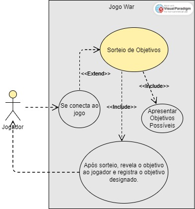

## Identificação
**Aluno**: Lucas Júlio Ribeiro de Aguiar

**Responsável por**: Todos os objetivos relacionados à conquista de territórios e continentes

**Projeto**: War C3

## Descrição da Atividade

No início do jogo: 
<ul>
  <li>Os jogadores fazem uma leitura de todos os objetivos possíveis</li>
  <li>Cada jogador então recebe, por sorteio, uma carta-objetivo</li>
  <li>Ao tomar conhecimento de seu objetivo, o jogador não revela a seus adversários</li>
</ul>

Eu sou responsável por apresentar todos os objetivos possíveis, sortear os objetivos entre os jogadores e certificar que um objetivo de território ou continente foi alcançado, determinando assim o vencedor.

## Detalhes importantes:
<ul>
  <li>Os objetivos restantes não serão utilizados no jogo</li>
  <li>No caso do número de jogadores ser inferior a 6, os objetivos relacionados com os exércitos não participantes devem ser excluídos do sorteio.</li>
  
Ex: Se ninguém escolher os exércitos amarelos, a carta-objetivo que manda destruir os exércitos amarelos deve ser retirada.

</ul>

## Fim de jogo (objetivo alcançado)

 Caso algum objetivo de conquista de continentes ou territórios for alcançado, é declarado um vencedor e o jogo acaba.

## Diagrama de Casos de Uso

## Modelo de Domínio

.png)

## Especificação de casos de uso

|Caso de Uso CD1     |                |
|--------------------|----------------|
|Nome do Caso de Uso |Sorteio dos Objetivos|
|Escopo              |Projeto do Jogo War|
|Nível               |Objetivo do Usuário|
|Ator principal      |Participantes do Jogo| 
|Interessados e interesses|
Participantes do Jogo: Os participantes desejam descobrir qual será seu objetivo no jogo, o que é parte  fundamental do jogo War
 
Sistema do Jogo: O sistema tem interesse de definir o objetivo dos participantes.
|
|Pré-condições       |
 Todos os objetivos constam no sistema de jogo 
 
 Os jogadores devem estar conectados ao sistema.
 
 |
|Garantia de sucesso | 
 Ao final do sorteio, todos participantes devem ter um objetivo
 
 Os objetivos que sobrarem não devem ser utilizados no jogo.
|
|Cenário de sucesso principal|
 1. Após iniciado, o sistema apresenta todos os objetivos possíveis aos jogadores.
 
2. O sistema embaralha e sorteia os objetivos.
 
3. Cada participante recebe um objetivo e o mesmo não pode ser revelado aos demais participantes.
 
 4. Os jogadores confirmam ao sistema que receberam o objetivo e o sistema, por sua vez, registra os objetivos atribuídos a cada jogador. 
 
 5. O jogo está pronto para ser iniciado.
|
|Extensões|
1a. O sistema armazena objetivos de conquista de terrítorios ou continentes em sua memória, para que a cada início de jogo todos objetivos estejam disponíveis para sorteio.
 
3a. Uma vez designados os objetivos, aqueles que sobrarem devem ser desconsiderados.
 
3b. Sistema faz uma verificação para que participantes não recebam o mesmo objetivo e caso isso aconteça o sistema apresenta uma mensagem de erro e sorteio é realizado novamente.
|
|Requisitos especiais| 
 Sorteio é apresentado de forma interativa na tela do usuário, inclusive o seu objetivo designado.
 
 O participante deve poder escolher um idioma para jogar. 
 
 O jogo deve poder ser jogado online atráves da escolha de um servidor designado para sua região. 

|Lista de Variantes Tecnológicas e de Dados|O sorteio pode ser realizado através de um clique ou comando de voz.
|Frequência da Ocorrência| O sorteio dos objetivos ocorre uma vez no início de cada partida do jogo.|

### Contrato de Operação

**Contrato CO1:** sorteiaObjetivo (Objetivo objetivoConquistaTerritorio, Objetivo objetivoConquistaContinente)

**Referências Cruzadas:** 
- Caso de Uso: Sortear Objetivos

**Pré-condições:**

- Todos os objetivos devem constar no sistema de jogo.
- Os jogadores devem estar conectados ao sistema.

**Pós-condições:**

- Criação de instâncias de objetos (objetivos atribuídos a cada jogador).
- Associações entre jogadores e seus objetivos.
- Modificações nos valores dos atributos (estado dos objetivos).

**Projeto de Objetos para a Pré-condição:**

Nessa fase, é preciso criar as instâncias de objetos necessárias antes de executar a operação. Com base nas pré-condições, tem-se os seguintes objetos:

- Objetivo: Representa um objetivo específico no jogo.
- Jogador: Representa um jogador conectado ao sistema. (Cada jogador deve ter uma lista de objetivos vazia inicialmente)

**Projeto de Objetos para a Pós-condição:**

Após a operação, tem-se as seguintes modificações nos objetos:

- Objetivo: Cada jogador terá objetivos atribuídos a eles.
- Jogador: Cada jogador estará associado aos objetivos que lhes foram sorteados.

## Diagrama de Comunicação

.jpeg)

## Diagrama de Classes

