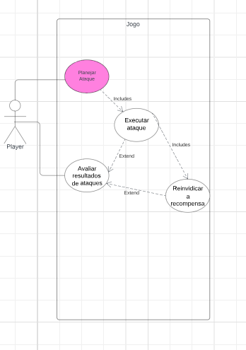
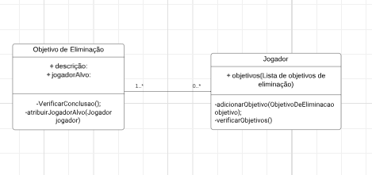

## Identificação
**Aluno**: Luiz Eduardo Cajueiro Crisanto

**Responsável por**: Objeito de eliminação

**Projeto**: War C3

## Descrição da Atividade

<ul>
  <li>Quando ocorrer a eliminção de um jogador, deve ser feito uma checkagem de objeito </li>
  <li>Se o jogador que eliminou, tiver no objetivo a eliminação, fim do jogo.</li>
</ul>

Eu sou responsável por fazer a checkagem dos objetivos de eliminação e fazer os objetivos

## Fim do jogo (objetivo alcançado)

 Caso o objetivo de eliminação seja concluído é declarado um vencedor e o jogo acaba, se não, o jogo continua e passa para o próximo objetivo da carta

## Diagrama de Casos de Uso

## Diagrama de Classe

## Especificação de casos de uso

|Caso de Uso CD1     |                |
|--------------------|----------------|
|Nome do Caso de Uso |Avaliar os resultados de ataque|
|Escopo              |Projeto do Jogo War|
|Nível               |Operações do Usuário|
|Ator principal      |Participantes do Jogo| 
|Interessados e interesses|Jogador: Deseja eliminar adversários específicos para cumprir objetivos e potencialmente ganhar vantagens no jogo. Adversários: Querem evitar ser eliminados e podem tomar ações para se proteger. Sistema: Deve validar as eliminações e garantir que elas sigam as regras do jogo.|
|Pré-condições       |O jogador deve ter um objetivo de eliminação designado. O jogador deve ter recursos suficientes (por exemplo, tropas) para tentar eliminar um adversário.|
|Garantia de sucesso |O jogador alvo é eliminado do jogo conforme as condições do objetivo de eliminação, e o jogador recebe quaisquer recompensas associadas ao cumprimento do objetivo.|
|Cenário de sucesso principal|1. O jogador identifica o alvo conforme definido pelo seu objetivo de eliminação. 2. O jogador planeja e executa ações (ataques) para eliminar o alvo. 3. O sistema verifica se o alvo foi eliminado conforme as condições do objetivo. 4. O alvo é eliminado do jogo. 5. O jogador recebe recompensas por cumprir o objetivo.|
|Extensões           |3a. Se o alvo não pode ser eliminado (por exemplo, defesas bem-sucedidas, regras do jogo): 3a1. O jogador pode tentar uma nova estratégia ou direcionar recursos para outros objetivos.|

### Contrato CO2: avaliarResultadosDeAtaque

**Operação:** avaliarResultadosDeAtaque(jogadorAtacante, jogadorAlvo)

**Referências Cruzadas:**  
- Casos de Uso: Avaliar os resultados de ataque

**Pré-Condições:**  
- O jogo deve estar em andamento.
- Existe um 'jogador' e um 'alvo', ambos devem ser jogadores ativos no jogo.
- O 'jogador' deve ter um objetivo de eliminação designado que inclua o 'alvo'.
- O 'jogador' deve ter recursos suficientes (por exemplo, tropas) para realizar o ataque.

**Pós-Condições:**  
- Foi determinado o resultado do ataque.
- Se o alvo é eliminado:
  - Foi criada a condição de eliminação do 'alvo' (criação de instância).
  - O 'jogador' recebe atualizações no estado de jogo (modificação de atributo).
  - As associações de território foram atualizadas (associação formada).
- Se o alvo sobrevive:
  - O 'alvo' continua no jogo, potencialmente com ajustes de recursos ou posição (modificação de atributo).