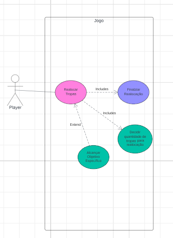
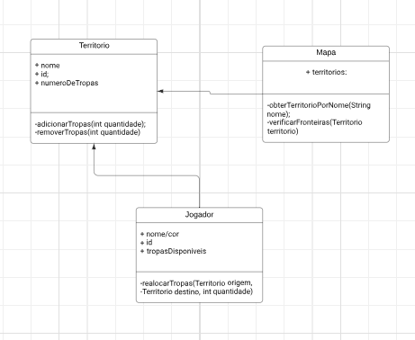

## Identificação
**Aluno**: Luiz Eduardo Cajueiro Crisanto

**Responsável por**: Fase de realocação dos territórios no fim da jogada 

**Projeto**: War C3

## Descrição da Atividade

No início do jogo: 
<ul>
  <li>Ao fim de cada fase de ataque, ocorre a fase de realocação </li>
  <li>o jogador da vez pode ou não realizar transferência de tropas entre seus territórios que realizam fronteira</li>
</ul>

Eu sou responsável por fazer com que as tranferências realizadas sejam concluídas

## Transferência de Tropas (objetivo alcançado)

 Caso o território tenha 2+ tropas e for fronteira com o território que o jogador deseja realizar a transferência, deve ocorrer. Caso o jogador não queira realizar a transfência, deve passar a vez.

## Diagrama de Casos de Uso

## Diagrama de Classe

## Especificação de casos de uso

|Caso de Uso CD1     |                |
|--------------------|----------------|
|Nome do Caso de Uso |Realocar Tropas|
|Escopo              |Projeto do Jogo War|
|Nível               |Operação do usuário|
|Ator principal      |Jogador| 
|Interessados e interesses|Jogador: Quer realocar tropas para fortalecer territórios estratégicos e preparar para a próxima fase do jogo.   Adversários: Desejam saber como a realocação afeta sua estratégia.   Sistema: Deve garantir que a realocação siga as regras do jogo|
|Pré-condições       |A fase de ataque do jogador deve ter terminado. O jogador deve ter pelo menos um território com mais de uma tropa.|
|Garantia de sucesso |Tropas realocadas de acordo com as escolhas do jogador, respeitando as regras do jogo.|
|Cenário de sucesso principal|1. O jogador seleciona um território de origem com mais de uma tropa.   2. O jogador seleciona um território de destino adjacente controlado por ele.   3. O jogador escolhe o número de tropas para realocar.   4. O sistema verifica a validade da realocação.   5. O sistema realoca as tropas.   6. O sistema atualiza o estado do jogo e informa todos os jogadores.|
|Extensões           |4a. Se a realocação não for válida:     4a1. O sistema informa o jogador sobre o erro.     4a2. O jogador escolhe outra ação de realocação ou finaliza sua vez.|
